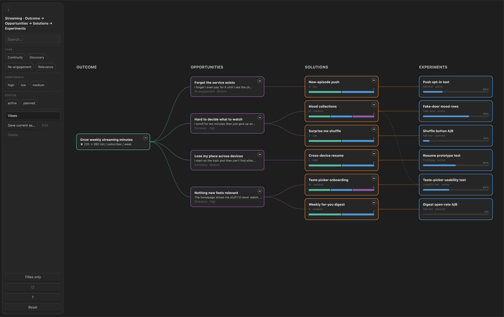
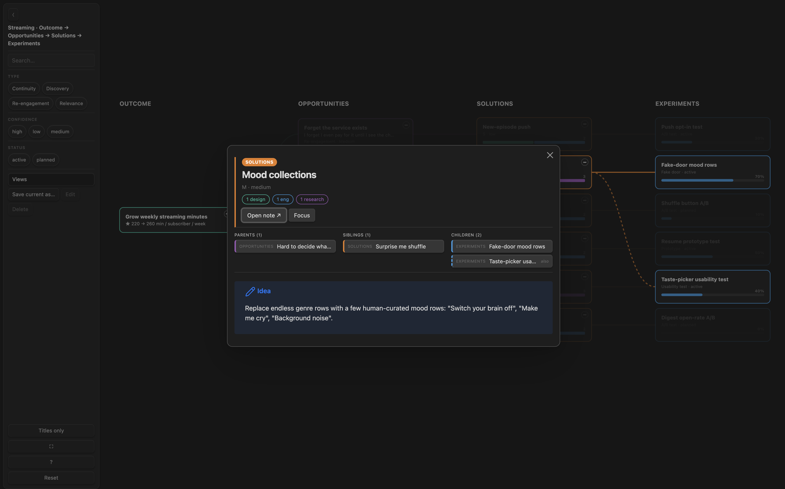
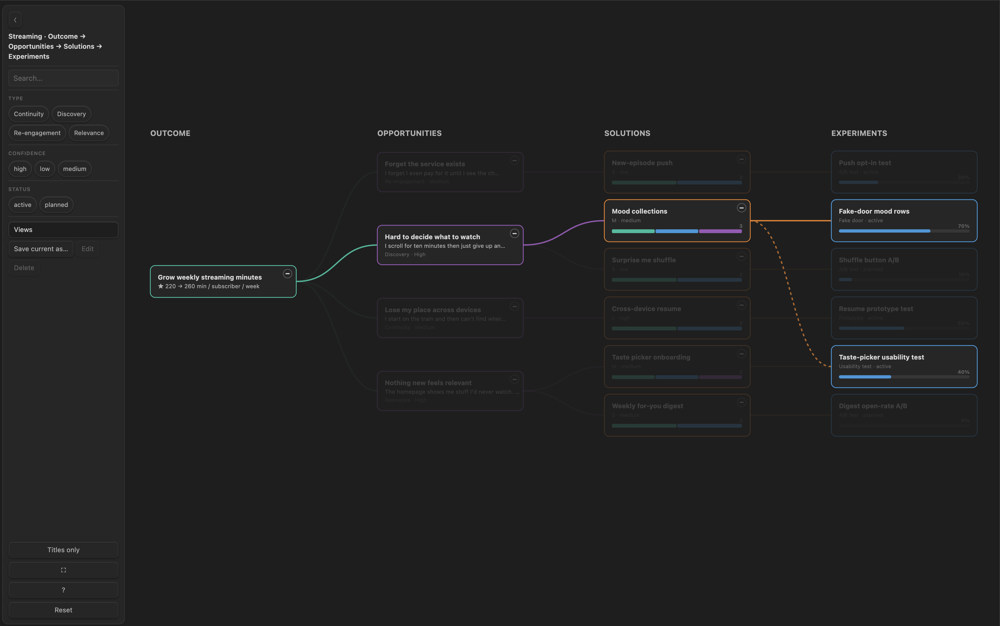
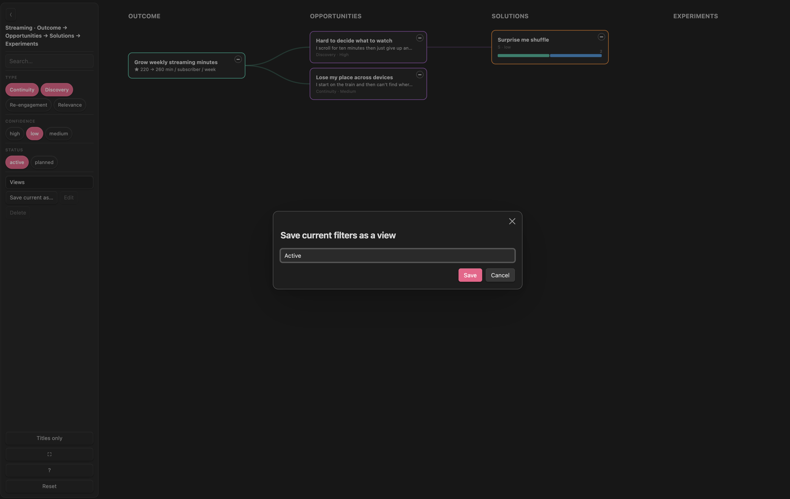
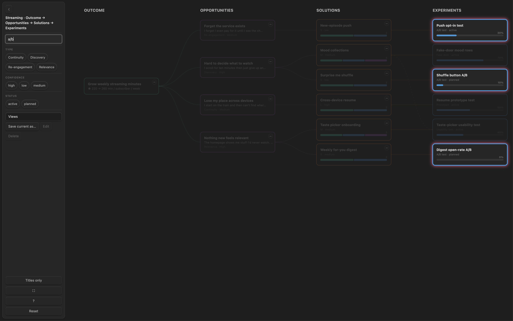
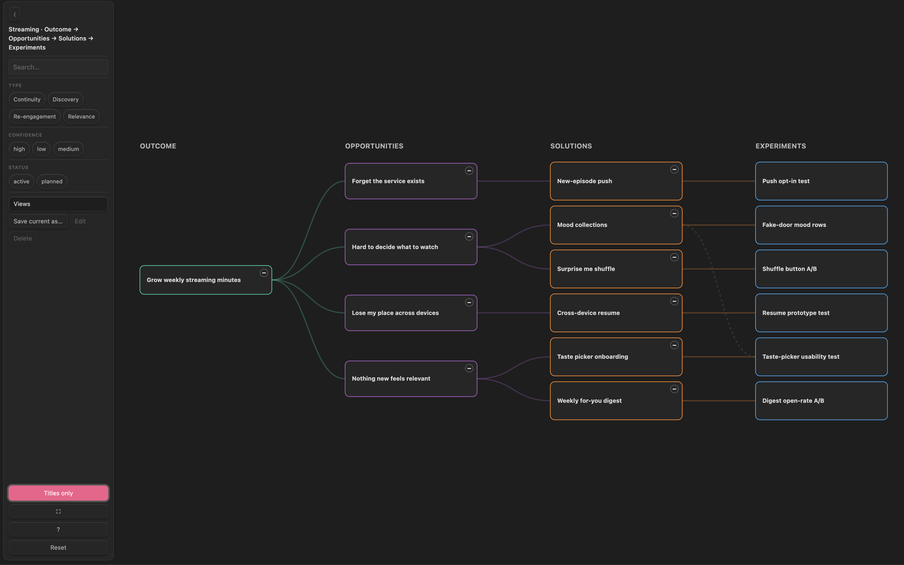
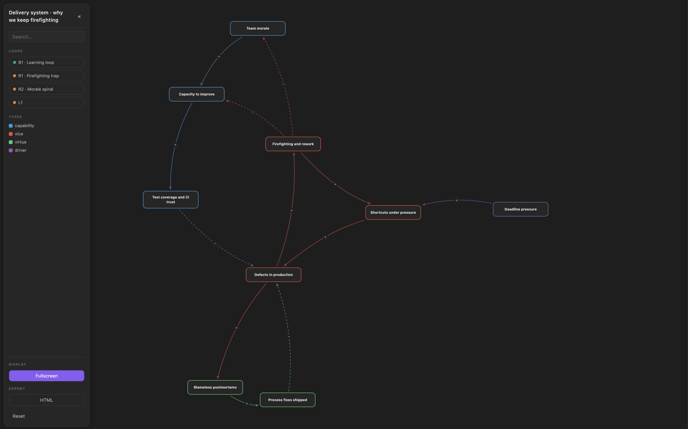
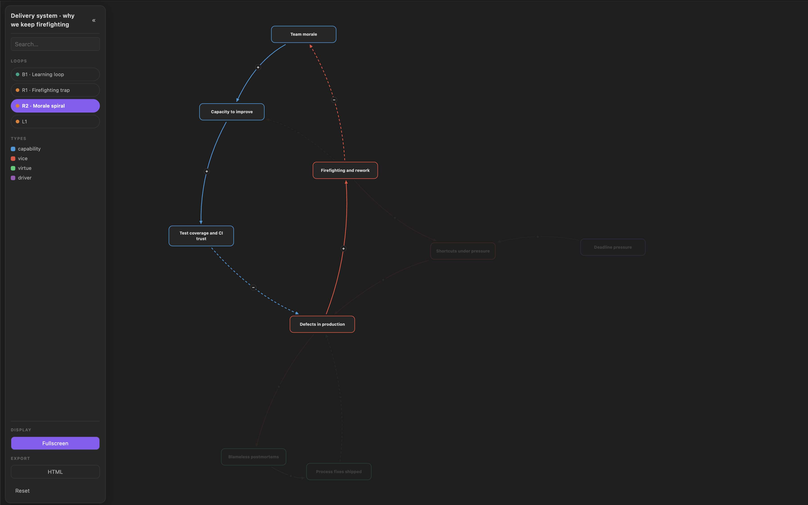

# Markdown Mindmap

[](https://github.com/kikocastro/markdown-mindmap/actions/workflows/test.yml)

An [Obsidian](https://obsidian.md) plugin that renders configurable mind maps (leveled, left-to-right trees) **live from your notes' frontmatter links**. Each map is a single fenced ` ```mindmap ` code block, so you can drop as many maps as you like anywhere in your vault. There is no separate data file to keep in sync: the tree is rebuilt from your notes every time you open it.

Point it at some folders, tell it which frontmatter field links each note to its parent, and it draws the graph: a column per level, curved edges, hover to highlight a node's lineage, click to open the note, collapse/expand subtrees, filter, and search.

It ships as **two adapters over one shared core** (`src/graph.ts`): the **Obsidian plugin** (the full experience described below, rendered inline in a note) and a **VS Code extension** (a command opens the map in a panel — see [VS Code](#vs-code)). The feature list below describes the Obsidian plugin; the VS Code adapter is intentionally minimal for now (render + pan/zoom + click-to-open).

## Screenshots



| Card dialog                                                                                             | Hover lineage                                                                    |
| ------------------------------------------------------------------------------------------------------- | -------------------------------------------------------------------------------- |
|  |  |

| Saved views                                                                | Search highlight                                                    | Titles only                                            |
| -------------------------------------------------------------------------- | ------------------------------------------------------------------- | ------------------------------------------------------ |
|  |  |  |

| Causal map overview                                                                       | Causal loop spotlight                                                            |
| ----------------------------------------------------------------------------------------- | -------------------------------------------------------------------------------- |
|  |  |

## Features

- **Live from frontmatter.** Folders become columns; frontmatter links become edges. Add or remove a note and the map updates.
- **Three views over one dataset.** The same block renders as a mind **map**, a **gantt** (bars by start/due, progress fill, milestone diamonds), or a **kanban** board (columns by any field) — switch from the toolbar, filters and search apply everywhere.
- **Per-level card design.** Pick which fields show as title / subtitle / meta per level; cards auto-size to their content.
- **Edges from links.** A `[[wikilink]]`, plain title, basename, list, or nested field (`customFields.serves`) on either end of an edge.
- **Secondary (dashed) links.** Mark cross-links that should draw dashed and stay out of the layout spine (e.g. "also relates to").
- **Bar charts & progress bars.** Render a 0–100 field as a progress bar, or a list field as a stacked count-by-category bar.
- **Multi-select filters and saved views.** Toggle-chip filters per property (OR within a property, AND across), then save named filter combinations back into the map block. Each saved view also remembers which subtrees are collapsed.
- **Export.** Save the current map next to the note as a standalone HTML file or an editable Excalidraw drawing.
- **Search highlight.** A search box that spotlights matching cards and dims the rest.
- **Collapse / expand** any subtree, focus a node's lineage/subtree, **pan / zoom / fit / fullscreen**; click a card for a dialog with its linked parents/children, optional properties, and the rendered note.
- **Theme-aware.** Uses Obsidian CSS variables, so it follows your light/dark theme.

## How it works

A map is a list of **levels**. Each level reads notes from a `from:` folder and becomes a **column** (left to right, in the order you list them). **Edges** connect levels: an edge says _"notes in the child level point up to a note in the parent level via frontmatter field X"_.

```
 LEVEL 0          LEVEL 1              LEVEL 2
 ┌──────────┐     ┌──────────────┐     ┌────────────┐
 │  Goal A  │────▶│  Project 1   │────▶│   Task …    │
 │          │──┐  └──────────────┘     └────────────┘
 └──────────┘  │  ┌──────────────┐     ┌────────────┐
               └─▶│  Project 2   │────▶│   Task …    │
                  └──────────────┘     └────────────┘
        edge: project.goal=[[Goal A]]    edge: task.project=[[Project 1]]
```

## Install

### Community plugins (recommended)

[Markdown Mindmap](https://community.obsidian.md/plugins/markdown-mindmap) is in the Obsidian community plugin store:

1. **Settings → Community plugins → Browse**.
2. Search **"Markdown Mindmap"**, **Install**, then **Enable**.

Updates arrive through Obsidian's normal plugin-update flow.

### Manual (local testing / latest build)

1. Get the three build files (`main.js`, `manifest.json`, `styles.css`) — either from a [Release](../../releases) or by building from source (`npm install && npm run build`).
2. Copy them into `<your-vault>/.obsidian/plugins/markdown-mindmap/`.
3. Reload Obsidian, then **Settings → Community plugins → enable "Markdown Mindmap"**.

### BRAT

Once a release is published, install with [BRAT](https://github.com/TfTHacker/obsidian42-brat): _Add beta plugin_ → `kikocastro/markdown-mindmap`. BRAT-managed plugins also survive Obsidian Sync, unlike a hand-copied folder.

## Quick start

Put this in any note (Reading view or Live Preview):

````markdown
```mindmap
title: Goals → Projects → Tasks
levels:
  - id: goals
    label: GOALS
    from: planning/goals
    card: { title: title, sub: kpi }
  - id: projects
    label: PROJECTS
    from: planning/projects
    card: { title: title, meta: [status] }
  - id: tasks
    label: TASKS
    from: planning/tasks
    card: { title: title, meta: [status], progress: progress }
edges:
  - { from: goals,    to: projects, via: goal }     # each project note: goal: "[[Goal A]]"
  - { from: projects, to: tasks,    via: project }  # each task note: project: "[[Project 1]]"
filter: [status]
```
````

> A runnable copy of this map, with sample notes, lives in [`examples/mindmap-demo/`](examples/mindmap-demo). Copy that folder into your vault root and open `Mindmap demo.md`.

## Configuration reference

**Top level**

| Key            | Type            | Meaning                                                                                                              |
| -------------- | --------------- | -------------------------------------------------------------------------------------------------------------------- |
| `title`        | string          | Heading in the toolbar.                                                                                              |
| `height`       | number          | Component height in px (default `900`).                                                                              |
| `view`         | string          | Initial view: `map` (default), `gantt`, or `kanban`.                                                                 |
| `levels`       | list            | Columns, left to right. **Required.**                                                                                |
| `edges`        | list            | Parent → child links between levels.                                                                                 |
| `gantt`        | map             | Gantt view config (see [Gantt & kanban views](#gantt--kanban-views)). Configuring it adds the view to the switcher.  |
| `kanban`       | map             | Kanban view config (same section). Configuring it adds the view to the switcher.                                     |
| `filter`       | list of strings | Frontmatter properties exposed as multi-select chip filters.                                                         |
| `filterLabels` | map             | Rename a filter group's heading, e.g. `{ customFields.quarters: Quarter }`. Unlisted properties keep their raw name. |
| `layout`       | map             | Override card/column sizing (below). All keys optional.                                                              |
| `properties`   | boolean         | When `true`, the note dialog shows all frontmatter as a table above the rendered note.                               |
| `views`        | list            | Saved views (filters + collapse + view mode), managed by the toolbar's saved-view controls.                          |

**`layout`** (all optional, defaults shown)

| Key          | Default | Meaning                                                                                                                          |
| ------------ | ------- | -------------------------------------------------------------------------------------------------------------------------------- |
| `cardWidth`  | `270`   | Card width in px.                                                                                                                |
| `cardHeight` | `44`    | **Minimum** card height in px. Cards auto-size to their content (title lines, sub, meta, bar, labels); this only sets the floor. |
| `columnGap`  | `150`   | Horizontal gap between columns.                                                                                                  |
| `rowGap`     | `12`    | Vertical gap between stacked cards.                                                                                              |
| `top`        | `64`    | Top margin before the first card.                                                                                                |
| `titleLines` | `2`     | Title lines shown before truncating. Set `3` to allow longer titles; cards grow to fit automatically.                            |
| `subLines`   | `1`     | Subtitle (`sub`) lines shown before truncating. Set `2`+ to wrap a long subtitle onto multiple lines; cards grow to fit.         |

**Each level**

| Key     | Type       | Meaning                                                                                                                                                                                                                                              |
| ------- | ---------- | ---------------------------------------------------------------------------------------------------------------------------------------------------------------------------------------------------------------------------------------------------- |
| `id`    | string     | Unique id, referenced by edges. **Required.**                                                                                                                                                                                                        |
| `from`  | string     | Folder to read notes from (recursive). **Required.**                                                                                                                                                                                                 |
| `label` | string     | Column header.                                                                                                                                                                                                                                       |
| `color` | hex string | Column / card-border colour. Defaults cycle the [flatuicolors _defo_](https://flatuicolors.com/palette/defo) palette.                                                                                                                                |
| `where` | map        | Keep only notes whose frontmatter matches a value, e.g. `{ horizon: now }` to use only drivers with `horizon: now`, or `{ parentId: null }` to keep top-level notes (a `null` target matches null, empty, **or** missing). Multiple keys are AND-ed. |
| `card`  | map        | Which fields render on the card (below).                                                                                                                                                                                                             |

**Each card**

All card field values are frontmatter property names. Dotted paths work everywhere (`customFields.serves`, `nested.key`).

| Key        | Type             | Renders                                                                                                                                                                             |
| ---------- | ---------------- | ----------------------------------------------------------------------------------------------------------------------------------------------------------------------------------- |
| `title`    | field            | Bold title (falls back to the file name).                                                                                                                                           |
| `sub`      | field            | Subtitle line.                                                                                                                                                                      |
| `meta`     | list of fields   | A muted `·`-joined line.                                                                                                                                                            |
| `progress` | field (0–100)    | A progress bar.                                                                                                                                                                     |
| `bars`     | field **or** map | A stacked count-by-category bar (below).                                                                                                                                            |
| `labels`   | list of fields   | Small colored value pills along the card's bottom strip, one per field (e.g. `[kind, horizon, stage]`). Empty/missing fields drop out; pills that don't fit on one row are skipped. |

**`bars`** — either a field name (string) or a map:

| Key        | Type                | Meaning                                                                                                                                            |
| ---------- | ------------------- | -------------------------------------------------------------------------------------------------------------------------------------------------- |
| `field`    | field               | The list field to count. **Required.**                                                                                                             |
| `category` | `parens` \| `value` | How to derive each category. `parens` (default): text in trailing parens, else the value (`"Acme (client)"` → `client`). `value`: the whole value. |
| `colors`   | map                 | `category → hex`. Categories not listed cycle the auto palette. Omit to use the built-in `client`/`prospect`/`trial`/`customer` defaults.          |

`bars: demand` is shorthand for `bars: { field: demand, category: parens }`.

**Each edge**

| Key         | Type     | Meaning                                                                                                                                                          |
| ----------- | -------- | ---------------------------------------------------------------------------------------------------------------------------------------------------------------- |
| `from`      | level id | Parent level.                                                                                                                                                    |
| `to`        | level id | Child level.                                                                                                                                                     |
| `via`       | field    | The frontmatter field holding the link. By default it lives on the **`to`** notes and points up to a **`from`** note. Dotted paths work (`customFields.serves`). |
| `reverse`   | bool     | Set `true` when the field lives on the **`from`** notes and points down (e.g. a `serves:` list).                                                                 |
| `secondary` | bool     | Draw the edge **dashed** and keep it out of the layout spine (for "also relates to" cross-links).                                                                |

### How links resolve

A `via` value is matched, in order, against: Obsidian's own link resolution (`[[wikilink]]`), then the target's **basename**, then its `title` frontmatter, then its `id` frontmatter (so pm-style `parentId: p-broker-operator` hierarchies link up). A value may be a single link or a list. A note's **first non-secondary** parent is its layout parent (single-parent tree); any extra parents still draw edges.

## Gantt & kanban views

The same collected + filtered tree can render as a **gantt** or a **kanban** board. Add the config block(s) and a view switcher appears in the toolbar; set `view:` to make one the default. Filters, search, collapse, and saved views apply in every view — a saved view pins **filters + view mode**, so you can keep e.g. a "devops · gantt" view one click away.

````markdown
```mindmap
title: 2026 Roadmap
view: gantt
levels:
  - id: tasks
    from: strategy/2026 Roadmap_tasks
    where: { parentId: null }
    card: { title: title, labels: [status], meta: [start, due], progress: progress }
  - id: subtasks
    from: strategy/2026 Roadmap_tasks
    card: { title: title, progress: progress }
edges:
  - { from: tasks, to: subtasks, via: parentId }
gantt: { start: start, end: due }
kanban: { groupBy: status }
filter: [status, tags]
```
````

**`gantt`** — field names are frontmatter properties, like everything else:

| Key           | Type                                     | Meaning                                                                                                                                                  |
| ------------- | ---------------------------------------- | -------------------------------------------------------------------------------------------------------------------------------------------------------- |
| `start`       | field                                    | Start date (ISO, e.g. `2026-06-09`). **Required.**                                                                                                       |
| `end`         | field                                    | End/due date. **Required.**                                                                                                                              |
| `progress`    | field (0–100)                            | Bar fill. Defaults to the card's `progress` field.                                                                                                       |
| `scale`       | `week` \| `month` \| `quarter` \| `year` | Axis tick unit (default `month`). Also switchable from the toolbar's Scale chips.                                                                        |
| `density`     | `compact` \| `comfortable`               | Default `compact`. `comfortable` scales up rows and fonts for reading from a distance (presentations). Also switchable from the toolbar's Density chips. |
| `sortByStart` | bool                                     | Default `true`: rows sort by crescent start date (dateless last). `false` restores the raw tree/path order.                                              |
| `groupRows`   | bool                                     | Default `true`: rows follow the tree order with subtasks indented under parents. `false`: flat path order.                                               |

Rows render as bars from `start` to `end` with a progress fill. A task whose `start` equals its `end` (or that has only one of the two) renders as a **milestone diamond**. Tasks with neither date get a plain row. Click a row to open the note. The card's `labels` render as pills right of the bar (or at the axis origin for dateless rows). Nested items can be contracted/expanded with a per-row toggle — the same collapse state as the map view, so saved views' collapsed lists apply here too. The toolbar's **show subtasks** chip (under **Rows**) expands/contracts every parent row at once; it's off by default, so the gantt opens with nested rows hidden.

**`kanban`**

| Key       | Type            | Meaning                                                                                                  |
| --------- | --------------- | -------------------------------------------------------------------------------------------------------- |
| `groupBy` | field           | Column key (e.g. `status`). **Required.**                                                                |
| `columns` | list of strings | Explicit column order. Unlisted values found in the data are appended; valueless notes land in `(none)`. |
| `colors`  | map             | `value → hex` for column headers. Unlisted columns cycle the auto palette.                               |

Cards are the same cards as the map (title/sub/meta/progress/labels config all apply), stacked into columns by `groupBy` value.

### Migrating from the Project Manager plugin

Task notes written by Project Manager (`pm-task: true` frontmatter with `status`, `start`, `due`, `progress`, `priority`, `assignees`, `tags`, `parentId`/`subtaskIds`, `customFields.*`) render as-is: point a level's `from:` at your `*_tasks` folder, add the `gantt:`/`kanban:` blocks above, done. The plugin never writes task files — edit the note and the view re-renders. Editing, drag-rescheduling, notifications, recurring tasks, and the table view are deliberate non-goals.

## Advanced example

A product strategy tree, showing secondary dashed links, demand bars, and progress bars:

````markdown
```mindmap
title: North Star → Drivers → Opportunities → Roadmap
height: 860
properties: true
levels:
  - { id: northstar, label: NORTH STAR,   from: strategy/north-star,   color: "#1abc9c", card: { title: title, sub: metric } }
  - { id: drivers,   label: DRIVERS,       from: strategy/drivers,      color: "#9b59b6", card: { title: title, sub: metric } }
  - { id: opps,      label: OPPORTUNITIES, from: strategy/opportunities, color: "#e67e22", card: { title: title, labels: [kind, horizon], bars: demand } }
  - { id: roadmap,   label: ROADMAP,       from: strategy/roadmap,      color: "#e74c3c", where: { parentId: null }, card: { title: title, meta: [status], progress: progress } }
edges:
  - { from: drivers, to: opps,    via: ladders-to }
  - { from: opps,    to: roadmap, via: serves }
  - { from: opps,    to: roadmap, via: alsoServes, secondary: true }   # dashed
filter: [horizon, kind, status]
```
````

## Interactions

- **Search** box — spotlight cards matching title / sub / meta, dim the rest.
- **View switcher** — flip the same data between map / gantt / kanban (shown when `gantt:` or `kanban:` is configured).
- **Filter chips** — multi-select per property (OR within, AND across), with options sorted alphabetically.
- **Saved views** — save the current filter combination + view mode, apply it from the dropdown, edit it, or delete it. Each view also stores which subtrees are collapsed, so applying it restores that shape. Saved views are written to the block's `views:` key.
- **Export** — save the current map next to the note as a standalone `.html` file or an editable `.excalidraw` drawing.
- **Hover** a card — highlight its full up/down lineage.
- **Click** a card — open a dialog: title + file name, level badge, progress/demand breakdown, its **linked parents, siblings, and children** (click one to jump the dialog there), optional frontmatter properties, the rendered note, "Open note", and "Focus".
- **Focus** from a card dialog — show that node, its ancestors, and its primary descendants; click empty map space to clear focus.
- **Titles only** — toggle the toolbar button to hide each card's subtitle, meta, bars, and labels, leaving just the title.
- **+ / −** on a card — collapse / expand its subtree.
- **⟨ / ☰** — collapse the toolbar to a single button (and expand it back) when it gets in the way.
- **?** — open the quick-reference help dialog.
- **⛶** — fullscreen. **Reset** — clear filters/search/collapse/focus and refit.
- **Drag** to pan, **scroll** to zoom.

## Development

```bash
npm install
npm run dev     # esbuild watch → main.js (Obsidian) + dist/ (VS Code)
npm run build   # type-check + production build
```

Obsidian only loads `main.js`, `manifest.json`, and `styles.css`. For live iteration, symlink this folder into your vault:

```bash
ln -s "$(pwd)" "<your-vault>/.obsidian/plugins/markdown-mindmap"
```

(If you use Obsidian Sync, prefer a Release + BRAT, or commit the built files — Sync can remove a hand-linked plugin folder it doesn't recognize.)

### VS Code

The same core also drives a VS Code extension (`src/vscode/`). Unlike Obsidian, it does **not** render inline in the editor — you run a command and the map opens in a panel.

**Run it from source:**

1. Open this repo's folder in VS Code (the adapter lives in `src/vscode/`).
2. Press `F5` (Run and Debug → **Run Extension**). It builds, then opens an **Extension Development Host** window already pointed at `examples/`.
3. In that window, open a markdown note that contains a ` ```mindmap ` block (e.g. `mindmap-demo/Mindmap demo.md`).
4. Command Palette (`Cmd/Ctrl+Shift+P`) → **Markdown Mindmap: Open Map**. The graph opens in a panel beside the note: drag to pan, scroll to zoom, click a card to open that note.

**Notes:**

- **Config source:** the active note's first ` ```mindmap ` block (same YAML as Obsidian).
- **`from:` paths are relative to the workspace root**, and links resolve by note basename or `title` frontmatter (there's no vault link index outside Obsidian).
- **Visuals follow your VS Code theme** (via `--vscode-*` variables), so the map looks different from the Obsidian version by design.
- **Current scope:** render (map, gantt, or kanban per the block's `view:` key) + pan/zoom + click-to-open. The toolbar (search, filter chips, the view switcher, fullscreen, reset), collapse toggles, and the note dialog are Obsidian-only for now.

## Limits

- `from:` is folder-only (no tag / Dataview queries yet).
- Link resolution matches a wikilink, basename, `title`, or `id` — not an arbitrary shared field value (so a keyword like `stage: claims` won't auto-link unless a note of that basename/title/id exists).
- Layout centring assumes primary edges connect adjacent levels.
- Gantt: no dependency arrows and no date-range filtering yet (filters are discrete values).

## Causal maps (systems thinking)

Besides trees, the plugin renders **causal-loop diagrams** — multi-connected graphs for systems
thinking, built for diagnosing retrospectives, post-mortems, and spotting leverage points. One
fenced ` ```causalmap ` block per diagram (Obsidian only for now).

Each causal variable is a note carrying its **outgoing signed edges** in frontmatter. Topology is
stored once, on the source note — no separate edge file:

```yaml
---
id: untested-code-live # optional, defaults to the file name
label: Untested code live
type: vice # driver | vice | capability | virtue — colours the border
status: active
affects:
  - to: incident # id, note name, or [[wikilink]]
    sign: "+" # "+" moves the same direction (default), "-" opposite
    loops: [R1] # optional: name the loop(s) this edge belongs to
---
```

The block:

````yaml
```causalmap
title: Engineering system
folders: [systems/nodes]
loopFolders: [systems/loops]   # optional loop cards (id + label) naming detected loops
where: { status: active }
height: 700
```
````

What you get:

- **Cycles are detected automatically** (bounded simple-cycle search) and classified by sign
  parity: an even number of `-` edges makes a **reinforcing** loop, odd makes a **balancing**
  one. No hand-maintained loop lists to drift out of date.
- **Loop rail**: every detected loop as a chip (● amber = reinforcing, ● teal = balancing);
  click one to spotlight exactly its edges and nodes — the retro projector view. Loops whose
  edges share a `loops:` tag take that name; a matching card in `loopFolders` (frontmatter
  `id` + `label`) supplies the display label. Untagged cycles get auto names (`L1`, `L2`, …).
- **Signed edges**: curved arrows with a `+`/`−` badge; negative links draw dashed.
- **Deterministic force-directed layout** — the same notes always produce the same picture.
- Hover a node to light up everything it affects and is affected by; click it for the note
  dialog (linked rows carry their edge sign); search, fullscreen, HTML export, pan/zoom as in
  mindmaps.

Other keys: `edgesField` / `labelField` / `typeField` rename the frontmatter fields,
`typeColors` overrides the per-type palette, `layout: { nodeWidth, spacing, iterations }`
tunes the drawing, `properties: true` shows all frontmatter in the dialog.

> A runnable copy, with sample cards and loop notes, lives in
> [`examples/causalmap-demo/`](examples/causalmap-demo). Copy that folder into your vault root
> and open `Causal map demo.md`.

## License

MIT © Kiko Castro
