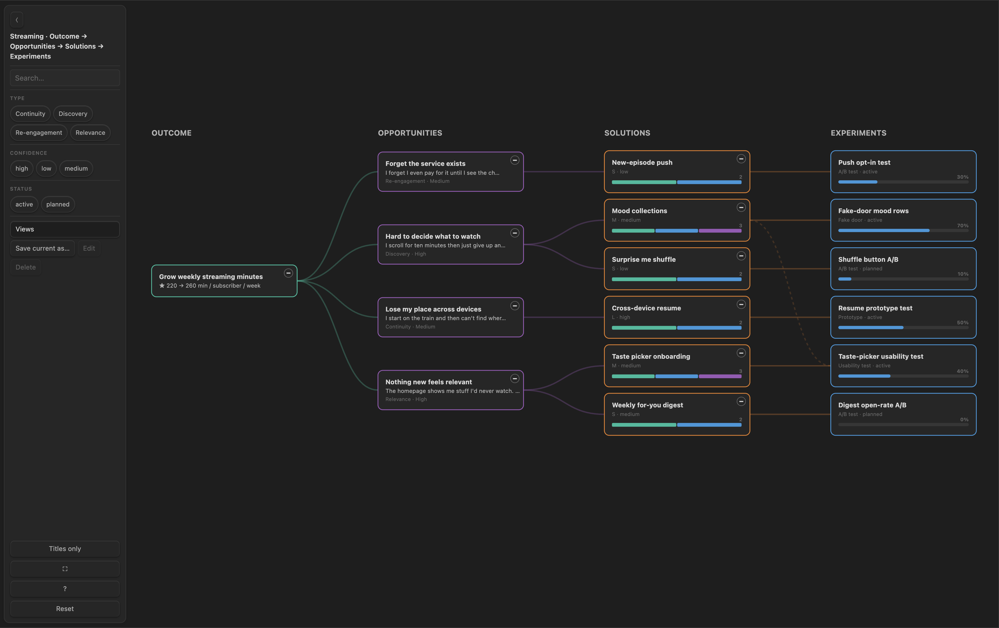
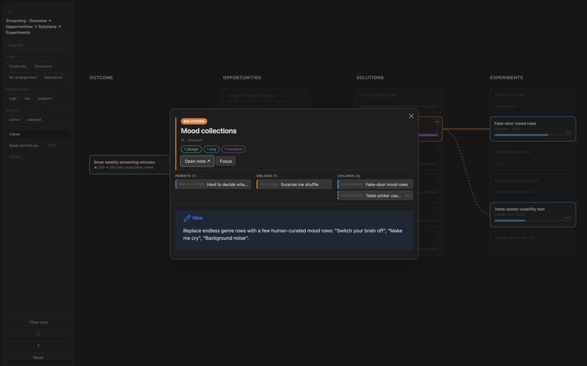
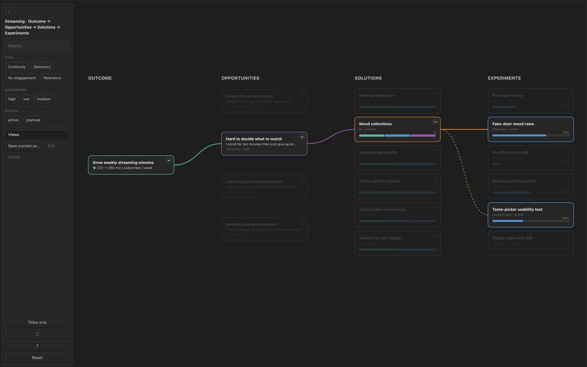
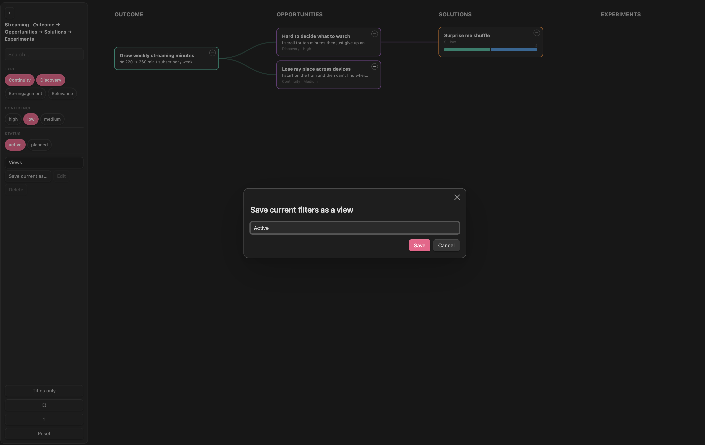
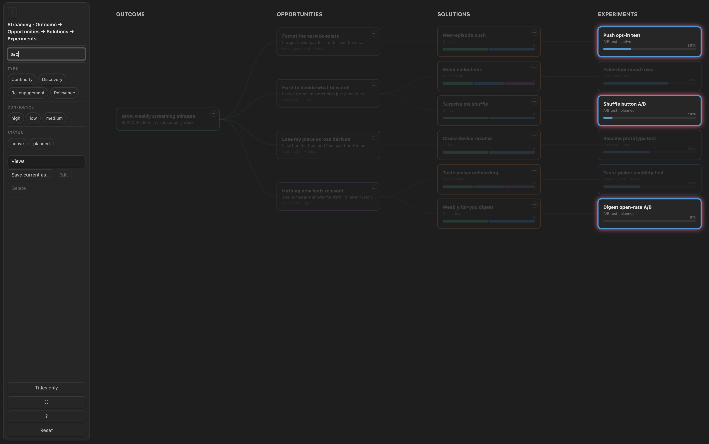
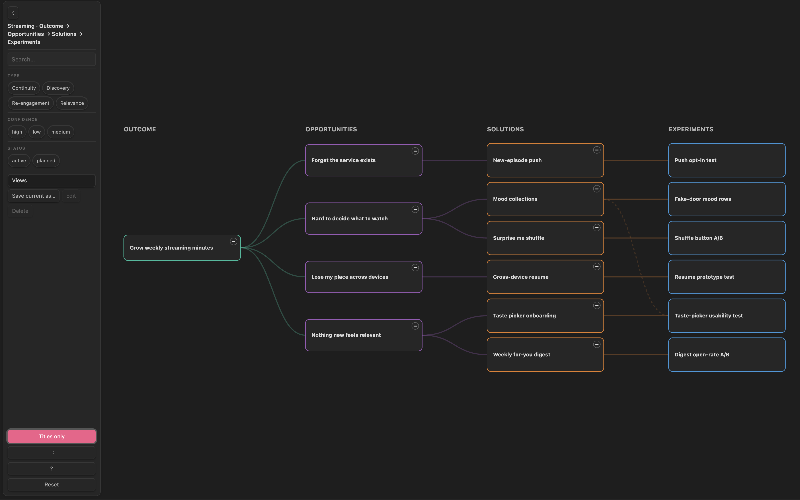
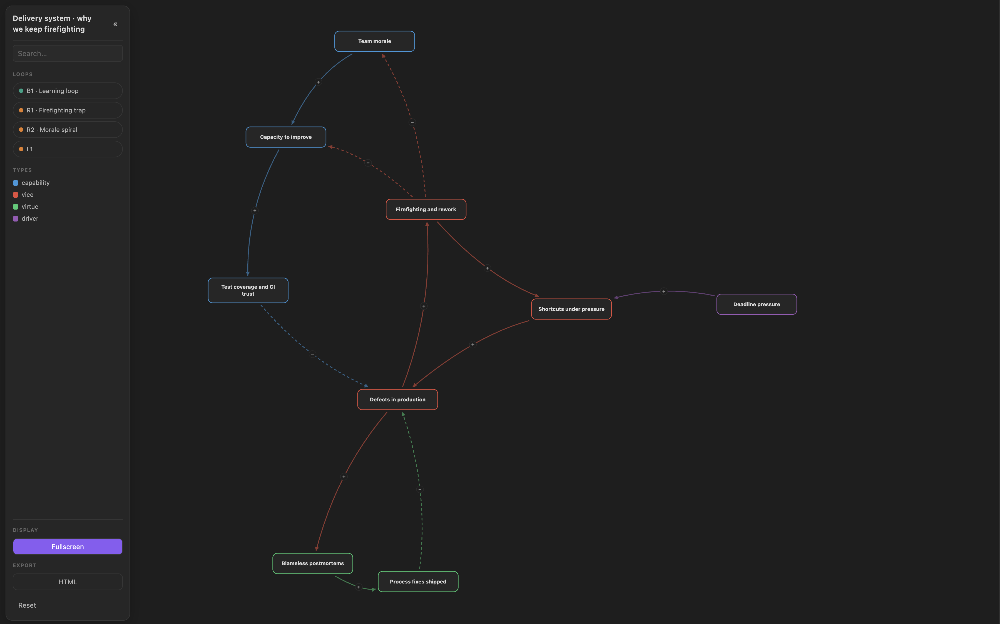
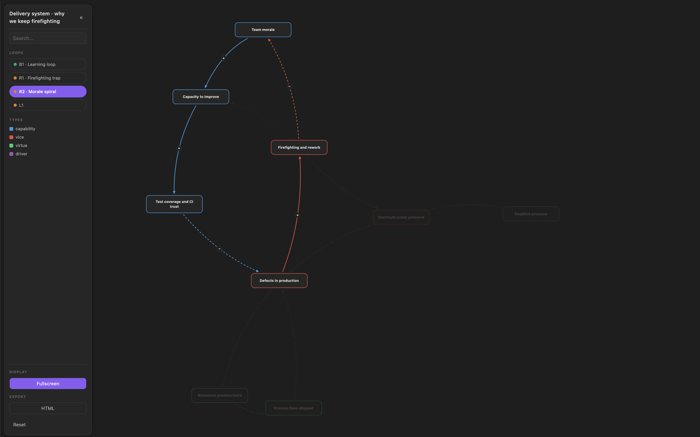

# Markdown Mindmap

[](https://github.com/kikocastro/markdown-mindmap/actions/workflows/test.yml)

**Draw your notes, live.** Markdown Mindmap reads the links you already keep in your notes' frontmatter and renders them — as a leveled mind map, a gantt chart, a kanban board, or a causal-loop diagram. There is no second copy of the data to maintain: every map is rebuilt from your notes each time you open it, so the picture can't drift from the source.

A map is one fenced code block, so you can drop as many as you like anywhere in your vault. There are two kinds:

- ` ```mindmap ` — a leveled left-to-right tree, switchable between **map**, **gantt**, and **kanban** views of the same notes.
- ` ```causalmap ` — a **causal-loop diagram** for systems thinking, with feedback loops detected automatically.

Point a block at some folders, name the frontmatter field that links each note to its parent, and it draws the graph.

## Screenshots



| Card dialog                                                                                             | Hover lineage                                                                    |
| ------------------------------------------------------------------------------------------------------- | -------------------------------------------------------------------------------- |
|  |  |

| Saved views                                                                | Search highlight                                                    | Titles only                                            |
| -------------------------------------------------------------------------- | ------------------------------------------------------------------- | ------------------------------------------------------ |
|  |  |  |

| Causal map overview                                                                       | Causal loop spotlight                                                            |
| ----------------------------------------------------------------------------------------- | -------------------------------------------------------------------------------- |
|  |  |

## What you get

- **Four pictures from one set of notes** — mind map, gantt, kanban, and causal-loop diagram, all driven by frontmatter you already write.
- **Cards you design per level** — choose which fields become the title, subtitle, meta line, progress bar, category bar, or coloured pills. Cards size themselves to fit.
- **Filters, search, and saved views** — multi-select chips per property, a search box that spotlights matches, and named filter combinations saved back into the block.
- **Navigation that respects the tree** — hover to light up a node's whole lineage, collapse any subtree, focus a branch, or open a card for its linked parents, siblings, and children.
- **Export** — save the current view as a standalone HTML file or an editable Excalidraw drawing.
- **Native-feeling** — themed with Obsidian's own CSS variables, so it follows your light/dark theme.
- **Two hosts** — everything above is the Obsidian plugin; a [VS Code extension](#vs-code) renders ` ```mindmap ` blocks from the same core, in a panel.

## Install

### Community plugins (recommended)

[Markdown Mindmap](https://community.obsidian.md/plugins/markdown-mindmap) is in the Obsidian community plugin store: **Settings → Community plugins → Browse**, search **"Markdown Mindmap"**, **Install**, then **Enable**. Updates arrive through Obsidian's normal plugin-update flow.

### BRAT

For pre-release builds, use [BRAT](https://github.com/TfTHacker/obsidian42-brat): _Add beta plugin_ → `kikocastro/markdown-mindmap`. BRAT-managed plugins also survive Obsidian Sync, unlike a hand-copied folder.

### Manual

Get the three build files (`main.js`, `manifest.json`, `styles.css`) from a [Release](../../releases) or by building from source (`npm install && npm run build`), copy them into `<your-vault>/.obsidian/plugins/markdown-mindmap/`, reload Obsidian, and enable the plugin under **Settings → Community plugins**.

## Quick start

Put this in any note and open it in Reading view or Live Preview:

````markdown
```mindmap
title: Goals → Projects → Tasks
levels:
  - id: goals
    label: GOALS
    from: planning/goals
    card: { title: title, sub: kpi }
  - id: projects
    label: PROJECTS
    from: planning/projects
    card: { title: title, meta: [status] }
  - id: tasks
    label: TASKS
    from: planning/tasks
    card: { title: title, meta: [status], progress: progress }
edges:
  - { from: goals,    to: projects, via: goal }     # each project note: goal: "[[Goal A]]"
  - { from: projects, to: tasks,    via: project }  # each task note: project: "[[Project 1]]"
filter: [status]
```
````

Three folders become three columns; the `goal:` and `project:` frontmatter fields become the arrows between them; `status` becomes a row of filter chips.

Two runnable demos ship with the repo — copy either folder into your vault root and open its note:

- [`examples/mindmap-demo/`](examples/mindmap-demo) — vision → areas → features → tasks, exercising per-level colours, a reverse edge, category bars, and a dashed secondary link.
- [`examples/ost-demo/`](examples/ost-demo) — an Opportunity Solution Tree with interview-quote subtitles and a saved view.

See [`examples/README.md`](examples/README.md) for what each one demonstrates.

## How it works

A map is a list of **levels**. Each level reads notes from a `from:` folder and becomes a **column**, left to right in the order you list them. **Edges** connect levels: an edge says _"notes in the child level point up to a note in the parent level via frontmatter field X"_.

```
 LEVEL 0          LEVEL 1              LEVEL 2
 ┌──────────┐     ┌──────────────┐     ┌────────────┐
 │  Goal A  │────▶│  Project 1   │────▶│   Task …    │
 │          │──┐  └──────────────┘     └────────────┘
 └──────────┘  │  ┌──────────────┐     ┌────────────┐
               └─▶│  Project 2   │────▶│   Task …    │
                  └──────────────┘     └────────────┘
        edge: project.goal=[[Goal A]]    edge: task.project=[[Project 1]]
```

By default the linking field lives on the **child** notes and points up. Set `reverse: true` when it lives on the parent and points down (a `serves:` list, say). Mark an edge `secondary: true` and it draws **dashed** and stays out of the layout spine — the way to show "also relates to" without distorting the tree.

### How links resolve

A `via` value is matched, in order, against Obsidian's own link resolution (`[[wikilink]]`), then the target's **basename**, then its `title` frontmatter, then its `id` frontmatter — so pm-style `parentId: p-broker-operator` hierarchies link up. A value may be a single link or a list.

A note's **first non-secondary** parent is its layout parent, keeping the drawing a single-parent tree; any extra parents still draw their edges.

### How filters treat the hierarchy

A filter only constrains notes that **have** the property — a note missing it is never hidden by that chip. What differs is what happens to the notes around a match:

- **Strict (default).** A note that fails the filter hides itself and its whole primary subtree. Right for "show me only the devops tasks", where a parent that isn't devops shouldn't drag its children along.
- **`filterKeepsHierarchy: true`.** A match keeps its context: its subtree rides along (a matching epic still shows its subtasks, whatever their own status) and its ancestors stay visible as scaffolding. Right for a roadmap where the tree shape matters.

Collapse applies last either way, so a contracted subtree stays hidden.

### A fuller example

A product strategy tree using per-level colours, secondary dashed links, category bars, and progress bars:

````markdown
```mindmap
title: North Star → Drivers → Opportunities → Roadmap
height: 860
properties: true
levels:
  - { id: northstar, label: NORTH STAR,   from: strategy/north-star,   color: "#1abc9c", card: { title: title, sub: metric } }
  - { id: drivers,   label: DRIVERS,       from: strategy/drivers,      color: "#9b59b6", card: { title: title, sub: metric } }
  - { id: opps,      label: OPPORTUNITIES, from: strategy/opportunities, color: "#e67e22", card: { title: title, labels: [kind, horizon], bars: demand } }
  - { id: roadmap,   label: ROADMAP,       from: strategy/roadmap,      color: "#e74c3c", where: { parentId: null }, card: { title: title, meta: [status], progress: progress } }
edges:
  - { from: drivers, to: opps,    via: ladders-to }
  - { from: opps,    to: roadmap, via: serves }
  - { from: opps,    to: roadmap, via: alsoServes, secondary: true }   # dashed
filter: [horizon, kind, status]
```
````

## The three views

One ` ```mindmap ` block can draw its notes three ways. Add a `gantt:` or `kanban:` config and a **View** switcher appears in the toolbar; set `view:` to choose which one opens by default. Filters, search, and collapse are applied _before_ layout, so they behave identically in all three — and a saved view pins the filters **and** the view type, letting you keep a "devops · gantt" one click away.

````markdown
```mindmap
title: 2026 Roadmap
view: gantt
levels:
  - id: tasks
    from: strategy/2026 Roadmap_tasks
    where: { parentId: null }
    card: { title: title, labels: [status], meta: [start, due], progress: progress }
  - id: subtasks
    from: strategy/2026 Roadmap_tasks
    card: { title: title, progress: progress }
edges:
  - { from: tasks, to: subtasks, via: parentId }
gantt: { start: start, end: due }
kanban: { groupBy: status }
filter: [status, tags]
```
````

**Map** is the default: a column per level, curved edges, cards centred on their children.

**Gantt** lays the same tree out against a time axis. Rows run from `start` to `end` with a progress fill; a task whose dates are equal — or that has only one of them — becomes a **milestone diamond**, and a task with neither gets a plain row. Bars take their colour from the note's `status`, matched case-insensitively, with the spaced and hyphenated spellings of each both recognised:

- **green** — `done`, `complete`, `completed`, `closed`, `shipped`
- **blue** — `in progress`, `in-progress`, `doing`, `active`, `wip`, `started`, `ongoing`
- **grey** — `todo`, `to do`, `to-do`, `planned`, `backlog`, `open`, `not started`, `new`, `pending`

Anything else — or a missing status — falls back to the level's colour. A vertical **today** marker appears when the current date is in range, and hovering a row shows its title, dates, status, progress, and tags.

By default rows sort by start date _within_ the hierarchy — siblings and roots are ordered by date, but children stay grouped under their parent, never flattened. Nested rows share the map's collapse state, so a saved view's collapsed list applies here too.

**Kanban** stacks the same cards into columns by any frontmatter field. All the card configuration carries over; notes with no value gather under a trailing `(none)` column.

Keys for all three live in the [configuration reference](#configuration-reference).

## Causal maps

A ` ```causalmap ` block renders a **causal-loop diagram** — the multi-connected graph systems thinkers use to diagnose retrospectives and post-mortems and to find leverage points. (Obsidian only for now.)

Each causal variable is a note carrying its **outgoing signed edges** in frontmatter, so the topology is stored once, on the source note, with no separate edge file:

```yaml
---
id: untested-code-live # optional, defaults to the file name
label: Untested code live
type: vice # driver | vice | capability | virtue — colours the border
status: active
affects:
  - to: incident # id, note name, or [[wikilink]]
    sign: "+" # "+" moves the same direction (default), "-" opposite
    loops: [R1] # optional: name the loop(s) this edge belongs to
---
```

The block itself just points at the folders:

````markdown
```causalmap
title: Engineering system
folders: [systems/nodes]
loopFolders: [systems/loops]   # optional loop cards (id + label) naming detected loops
where: { status: active }
height: 700
```
````

What the diagram gives you:

- **Loops found for you.** A bounded simple-cycle search detects every feedback loop and classifies it by sign parity — an even number of `-` edges makes a **reinforcing** loop, odd makes a **balancing** one. There is no hand-maintained loop list to fall out of date.
- **A loop rail.** Each detected loop becomes a chip (● amber = reinforcing, ● teal = balancing); click it to spotlight exactly that cycle's nodes and edges — the retro-projector view — and click again to release. Hovering shows the whole cycle as an `A → B → C → A` tooltip. Loops whose edges share a `loops:` tag take that name and lead the rail alphabetically, with a matching card in `loopFolders` supplying the display label; untagged cycles get auto names (`L1`, `L2`, …) in discovery order.
- **A type legend** listing the node types actually present, with their colours.
- **Signed edges** as curved arrows with a `+`/`−` badge; negative links draw dashed.
- **A deterministic layout.** The force-directed placement has no randomness, so the same notes always produce the same picture.

Hovering a node lights up everything it affects and is affected by; clicking one opens the note dialog, with each linked row carrying its edge sign. Search, fullscreen, HTML export, and pan/zoom work as they do in mindmaps.

> A runnable copy, with sample cards and loop notes, lives in [`examples/causalmap-demo/`](examples/causalmap-demo). Copy that folder into your vault root and open `Causal map demo.md`.

## Using a map

The toolbar is a rail down the left: title and search at the top, then chip groups (**View**, **Scale**, **Density**, **Rows**, one per filter property, and **Saved views**), then a footer holding **Display**, **Export**, and the **Reset** / **Help** row.

- **Search** — spotlight cards matching title / sub / meta and dim the rest.
- **View** chips — flip between map / gantt / kanban (shown once `gantt:` or `kanban:` is configured).
- **Scale**, **Density**, **Rows** chips — gantt only: the axis unit (week / month / quarter / year), compact vs comfortable row size for presenting, and **show subtasks** to expand or contract every parent row at once.
- **Filter chips** — multi-select per property, OR within a property and AND across them, options sorted alphabetically.
- **Saved views** — save the current filters and view type under a name, then apply, edit, or delete it from the dropdown. Each view also remembers which subtrees were collapsed. Views are written back into the block's `views:` key and the selected one into `activeView:`, so your choice survives a restart.
- **Export** — write the current view next to the note as a standalone `.html` file or an editable `.excalidraw` drawing. Both capture what's on screen: active filters, collapse state, and view type.
- **Hover** a card — highlight its full up/down lineage, in gantt and kanban as well as the map.
- **Click** a card — open a dialog with the title and file name, level badge, progress/category breakdown, its **linked parents, siblings, and children** (click one to jump there), optional frontmatter properties, the rendered note, and **Open note** / **Focus** buttons.
- **Focus** — narrow the map to a node, its ancestors, and its primary descendants. It persists while you pan and click; a **Focus: …** chip at the top of the rail clears it with **✕**.
- **Titles only** — strip cards back to their titles, hiding subtitle, meta, bars, and labels. (Not shown in the gantt, which draws rows rather than cards.)
- **+ / −** on a card, or a gantt row's toggle — collapse or expand that subtree.
- **«** / **☰** — collapse the whole rail to a single button when it's in the way, and bring it back.
- **Help** opens a quick reference · **Fullscreen** toggles fullscreen · **Reset** clears filters, search, collapse, focus, and titles-only, returns to the block's default view, and refits.
- **Drag** to pan, **scroll** to zoom. Clicking empty space clears the sticky hover highlight.

## Configuration reference

### `mindmap` — top level

| Key                    | Type            | Meaning                                                                                                                                                          |
| ---------------------- | --------------- | ---------------------------------------------------------------------------------------------------------------------------------------------------------------- |
| `levels`               | list            | Columns, left to right. **Required.**                                                                                                                            |
| `edges`                | list            | Parent → child links between levels.                                                                                                                             |
| `title`                | string          | Heading in the toolbar.                                                                                                                                          |
| `height`               | number          | Component height in px (default `900`).                                                                                                                          |
| `view`                 | string          | Initial view: `map` (default), `gantt`, or `kanban`.                                                                                                             |
| `gantt`                | map             | Gantt config (below). Configuring it adds the view to the switcher.                                                                                              |
| `kanban`               | map             | Kanban config (below). Configuring it adds the view to the switcher.                                                                                             |
| `filter`               | list of strings | Frontmatter properties exposed as multi-select chip filters.                                                                                                     |
| `filterLabels`         | map             | Rename a filter group's heading, e.g. `{ customFields.quarters: Quarter }`. Unlisted properties keep their raw name.                                             |
| `filterKeepsHierarchy` | boolean         | Default `false` (strict): a filtered-out note hides itself **and** its subtree. `true` keeps matches in context — see [above](#how-filters-treat-the-hierarchy). |
| `layout`               | map             | Override card/column sizing (below). All keys optional.                                                                                                          |
| `properties`           | boolean         | When `true`, the note dialog shows all frontmatter as a table above the rendered note.                                                                           |
| `views`                | list            | Saved views (filters + collapse + view type), managed by the toolbar.                                                                                            |
| `activeView`           | string          | Name of the saved view to re-select on render. Written by the toolbar when you pick one; cleared by **Reset**.                                                   |

### `levels[]`

| Key     | Type       | Meaning                                                                                                                                                                                                                                              |
| ------- | ---------- | ---------------------------------------------------------------------------------------------------------------------------------------------------------------------------------------------------------------------------------------------------- |
| `id`    | string     | Unique id, referenced by edges. **Required.**                                                                                                                                                                                                        |
| `from`  | string     | Folder to read notes from (recursive). **Required.**                                                                                                                                                                                                 |
| `label` | string     | Column header.                                                                                                                                                                                                                                       |
| `color` | hex string | Column / card-border colour. Defaults cycle the [flatuicolors _defo_](https://flatuicolors.com/palette/defo) palette.                                                                                                                                |
| `where` | map        | Keep only notes whose frontmatter matches a value, e.g. `{ horizon: now }` to use only drivers with `horizon: now`, or `{ parentId: null }` to keep top-level notes (a `null` target matches null, empty, **or** missing). Multiple keys are AND-ed. |
| `card`  | map        | Which fields render on the card (below).                                                                                                                                                                                                             |

### `levels[].card`

All card field values are frontmatter property names. Dotted paths work everywhere (`customFields.serves`, `nested.key`).

| Key        | Type             | Renders                                                                                                                                                                              |
| ---------- | ---------------- | ------------------------------------------------------------------------------------------------------------------------------------------------------------------------------------ |
| `title`    | field            | Bold title (falls back to the file name).                                                                                                                                            |
| `sub`      | field            | Subtitle line.                                                                                                                                                                       |
| `meta`     | list of fields   | A muted `·`-joined line.                                                                                                                                                             |
| `progress` | field (0–100)    | A progress bar.                                                                                                                                                                      |
| `bars`     | field **or** map | A stacked count-by-category bar (below).                                                                                                                                             |
| `labels`   | list of fields   | Small coloured value pills along the card's bottom strip, one per field (e.g. `[kind, horizon, stage]`). Empty/missing fields drop out; pills that don't fit on one row are skipped. |

**`bars`** takes either a field name or a map. `bars: demand` is shorthand for `bars: { field: demand, category: parens }`.

| Key        | Type                | Meaning                                                                                                                                            |
| ---------- | ------------------- | -------------------------------------------------------------------------------------------------------------------------------------------------- |
| `field`    | field               | The list field to count. **Required.**                                                                                                             |
| `category` | `parens` \| `value` | How to derive each category. `parens` (default): text in trailing parens, else the value (`"Acme (client)"` → `client`). `value`: the whole value. |
| `colors`   | map                 | `category → hex`. Categories not listed cycle the auto palette. Omit to use the built-in `client`/`prospect`/`trial`/`customer` defaults.          |

### `edges[]`

| Key         | Type     | Meaning                                                                                                                                                          |
| ----------- | -------- | ---------------------------------------------------------------------------------------------------------------------------------------------------------------- |
| `from`      | level id | Parent level.                                                                                                                                                    |
| `to`        | level id | Child level.                                                                                                                                                     |
| `via`       | field    | The frontmatter field holding the link. By default it lives on the **`to`** notes and points up to a **`from`** note. Dotted paths work (`customFields.serves`). |
| `reverse`   | bool     | Set `true` when the field lives on the **`from`** notes and points down (e.g. a `serves:` list).                                                                 |
| `secondary` | bool     | Draw the edge **dashed** and keep it out of the layout spine (for "also relates to" cross-links).                                                                |

### `gantt`

| Key           | Type                                     | Meaning                                                                                                                                  |
| ------------- | ---------------------------------------- | ---------------------------------------------------------------------------------------------------------------------------------------- |
| `start`       | field                                    | Start date (ISO, e.g. `2026-06-09`). **Required.**                                                                                       |
| `end`         | field                                    | End/due date. **Required.**                                                                                                              |
| `progress`    | field (0–100)                            | Bar fill. Defaults to the card's `progress` field.                                                                                       |
| `status`      | field                                    | Field driving the bar/milestone colour (default `status`).                                                                               |
| `scale`       | `week` \| `month` \| `quarter` \| `year` | Axis tick unit (default `month`). Also switchable from the toolbar's Scale chips.                                                        |
| `density`     | `compact` \| `comfortable`               | Default `compact`. `comfortable` scales up rows and fonts for reading from a distance. Also switchable from the toolbar's Density chips. |
| `sortByStart` | bool                                     | Default `true`: rows sort by crescent start date (dateless last). `false` restores the raw tree/path order.                              |
| `groupRows`   | bool                                     | Default `true`: rows follow the tree order with subtasks indented under parents. `false`: flat path order.                               |
| `showLabels`  | bool                                     | Default `true`: the card's `labels`, `·`-joined, on a discreet second line under the row title. `false` drops them for a barer chart.    |

### `kanban`

| Key       | Type            | Meaning                                                                                                  |
| --------- | --------------- | -------------------------------------------------------------------------------------------------------- |
| `groupBy` | field           | Column key (e.g. `status`). **Required.**                                                                |
| `columns` | list of strings | Explicit column order. Unlisted values found in the data are appended; valueless notes land in `(none)`. |
| `colors`  | map             | `value → hex` for column headers. Unlisted columns cycle the auto palette.                               |

### `layout`

| Key          | Default | Meaning                                                                                                                          |
| ------------ | ------- | -------------------------------------------------------------------------------------------------------------------------------- |
| `cardWidth`  | `270`   | Card width in px.                                                                                                                |
| `cardHeight` | `44`    | **Minimum** card height in px. Cards auto-size to their content (title lines, sub, meta, bar, labels); this only sets the floor. |
| `columnGap`  | `150`   | Horizontal gap between columns.                                                                                                  |
| `rowGap`     | `12`    | Vertical gap between stacked cards.                                                                                              |
| `top`        | `64`    | Top margin before the first card.                                                                                                |
| `titleLines` | `2`     | Title lines shown before truncating. Set `3` to allow longer titles; cards grow to fit automatically.                            |
| `subLines`   | `1`     | Subtitle (`sub`) lines shown before truncating. Set `2`+ to wrap a long subtitle onto multiple lines; cards grow to fit.         |

### `causalmap`

| Key           | Type            | Meaning                                                                                                          |
| ------------- | --------------- | ---------------------------------------------------------------------------------------------------------------- |
| `folders`     | list of strings | Folders holding the variable notes. **Required.**                                                                |
| `loopFolders` | list of strings | Folders with loop cards (frontmatter `id` + `label`) supplying display labels for declared loops.                |
| `where`       | map             | Keep only notes whose frontmatter matches, e.g. `{ status: active }`.                                            |
| `edgesField`  | string          | Frontmatter field holding the outgoing edges (default `affects`).                                                |
| `labelField`  | string          | Field holding the display label (default `label`, falling back to the file name).                                |
| `typeField`   | string          | Field holding the node type (default `type`).                                                                    |
| `typeColors`  | map             | `type → hex`, overriding the defaults: driver `#9b59b6`, vice `#e74c3c`, capability `#3498db`, virtue `#2ecc71`. |
| `title`       | string          | Heading in the toolbar.                                                                                          |
| `height`      | number          | Component height in px.                                                                                          |
| `properties`  | boolean         | When `true`, the note dialog shows all frontmatter.                                                              |
| `layout`      | map             | `nodeWidth` (default `180`), `spacing` (`270`), `iterations` (`300`) — tunes the force-directed drawing.         |

## Using Project Manager task notes

Task notes written by the Project Manager plugin (`pm-task: true` frontmatter with `status`, `start`, `due`, `progress`, `priority`, `assignees`, `tags`, `parentId`/`subtaskIds`, `customFields.*`) render as-is: point a level's `from:` at your `*_tasks` folder, add the `gantt:` and `kanban:` blocks, and you're done.

Markdown Mindmap never writes task files — edit the note and the view re-renders. Editing, drag-rescheduling, notifications, recurring tasks, and the table view are deliberate non-goals.

## VS Code

The same core drives a VS Code extension (`src/vscode/`). Unlike Obsidian it does **not** render inline in the editor — you run a command and the map opens in a panel.

To run it from source:

1. Open this repo's folder in VS Code.
2. Press `F5` (Run and Debug → **Run Extension**). It builds, then opens an **Extension Development Host** window already pointed at `examples/`.
3. In that window, open a markdown note containing a ` ```mindmap ` block (e.g. `mindmap-demo/Mindmap demo.md`).
4. Command Palette (`Cmd/Ctrl+Shift+P`) → **Markdown Mindmap: Open Map**. The graph opens beside the note: drag to pan, scroll to zoom, click a card to open that note.

Some differences from the Obsidian plugin:

- **Config comes from the active note's first ` ```mindmap ` block** (same YAML).
- **`from:` paths are relative to the workspace root**, and links resolve by note basename or `title` frontmatter — there's no vault link index outside Obsidian.
- **Visuals follow your VS Code theme** (via `--vscode-*` variables), so the map looks different by design.
- **Scope is render + pan/zoom + click-to-open**, for whichever view the block's `view:` key selects. The toolbar, collapse toggles, and the note dialog are Obsidian-only for now.

## Limits

- `from:` is folder-only — no tag or Dataview queries yet.
- Link resolution matches a wikilink, basename, `title`, or `id`, not an arbitrary shared field value: a keyword like `stage: claims` won't auto-link unless a note of that basename/title/id exists.
- Layout centring assumes primary edges connect adjacent levels.
- Gantt has no dependency arrows and no date-range filtering (filters are discrete values). Dates are read, never written — there's no drag-to-reschedule.
- Excalidraw export is lossy by design: rounded boxes, centred labels, straight arrows — no curves, progress bars, label pills, or column headers.
- Causal-map cycle detection is bounded (at most 64 loops, up to 12 nodes long), so a very dense graph reports the first loops found rather than all of them.

## Development

```bash
npm install
npm run dev     # esbuild watch → main.js (Obsidian) + dist/ (VS Code)
npm run build   # type-check + production build
npm test        # vitest + coverage
```

Obsidian loads only `main.js`, `manifest.json`, and `styles.css`. For live iteration, symlink this folder into your vault:

```bash
ln -s "$(pwd)" "<your-vault>/.obsidian/plugins/markdown-mindmap"
```

(If you use Obsidian Sync, prefer a Release + BRAT, or commit the built files — Sync can remove a hand-linked plugin folder it doesn't recognize.)

The pure logic lives in `src/core/` behind the `src/graph.ts` barrel, host-free and fully unit-tested; the Obsidian and VS Code adapters wrap it. See [`AGENTS.md`](AGENTS.md) for the architecture and conventions.

## License

MIT © Kiko Castro
