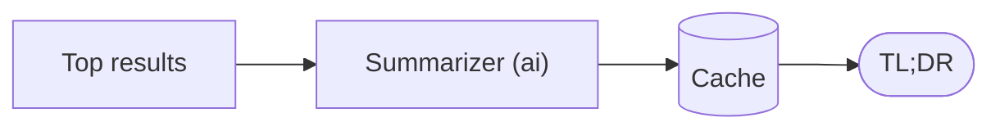

> [!note] What & why
> One paragraph beats ten links.

```mermaid
flowchart LR
    R["Top results"] --> S["Summarizer (ai)"] --> CA[("Cache")] --> OUT(["TL;DR"])
```

- [ ] Summarizer prompt
- [ ] Cache layer
