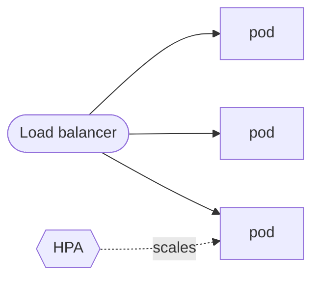

> [!note] What & why
> Survive the spike, sleep through the night.

```mermaid
flowchart LR
    LB(["Load balancer"]) --> P1["pod"] & P2["pod"] & P3["pod"]
    HPA{{"HPA"}} -. scales .-> P3
```

```mermaid
gantt
    title Rollout
    dateFormat X
    axisFormat %s
    section Infra
    Helm charts : done, 0, 3
    Load test   : active, 3, 5
```
