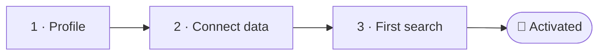

> [!note] What & why
> Hold the user's hand all the way to first value.

```mermaid
flowchart LR
    S1["1 · Profile"] --> S2["2 · Connect data"] --> S3["3 · First search"] --> D(["🎉 Activated"])
```

- [ ] Stepper UI
- [ ] Save progress between steps
