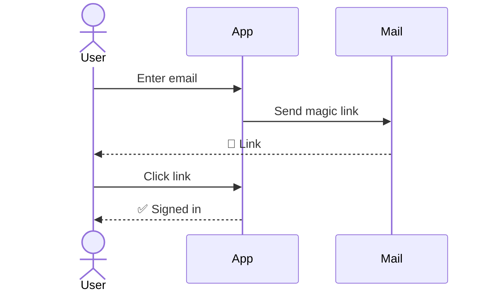

> [!note] What & why
> Passwordless sign-in. Fewer support tickets, higher activation.

```mermaid
sequenceDiagram
    actor U as User
    participant A as App
    participant M as Mail
    U->>A: Enter email
    A->>M: Send magic link
    M-->>U: 📧 Link
    U->>A: Click link
    A-->>U: ✅ Signed in
```

**Acceptance**

- [x] Email capture form
- [ ] Signed, expiring token
- [ ] One-click verify
