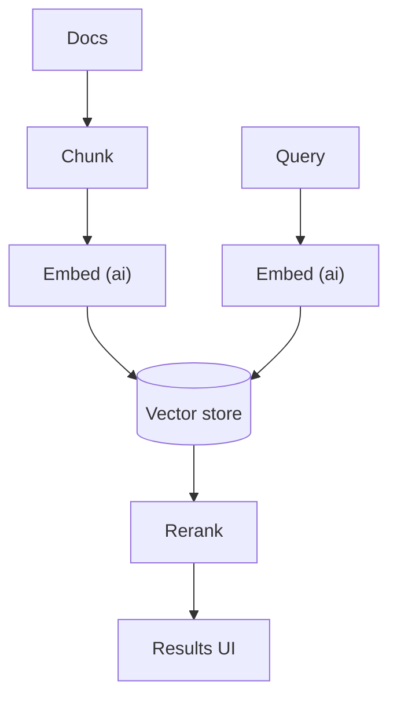

> [!note] What & why
> Search on meaning, not keywords.

```mermaid
flowchart TD
    D["Docs"] --> C["Chunk"] --> EM["Embed (ai)"] --> VI[("Vector store")]
    Q["Query"] --> EQ["Embed (ai)"] --> VI
    VI --> RR["Rerank"] --> UI["Results UI"]
```

| Metric      | Target   |
| ----------- | -------- |
| p95 latency | < 300 ms |
| recall@10   | > 0.9    |
