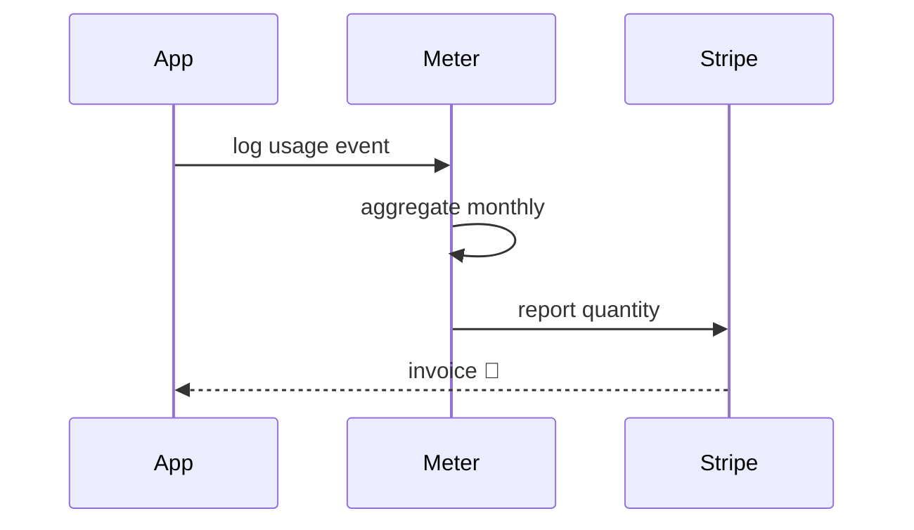

> [!note] What & why
> Meter real usage, charge fairly, automate the invoice.

```mermaid
sequenceDiagram
    participant App
    participant Meter
    participant Stripe
    App->>Meter: log usage event
    Meter->>Meter: aggregate monthly
    Meter->>Stripe: report quantity
    Stripe-->>App: invoice 🧾
```
