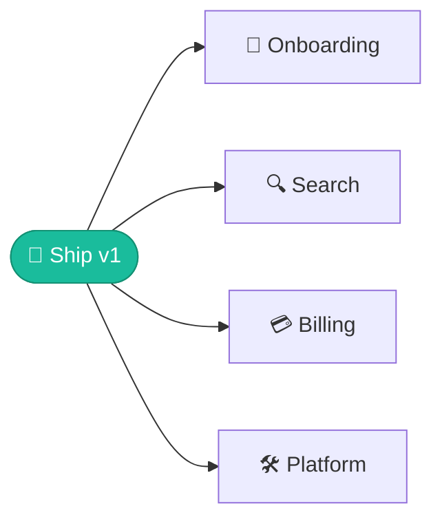
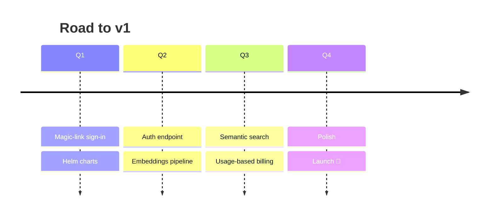

The one outcome everything below ladders up to.

> [!abstract] North star
> One year. One release people love. Four bets get us there.

```mermaid
flowchart LR
    V(["🎯 Ship v1"]) --> O["🚀 Onboarding"]
    V --> S["🔍 Search"]
    V --> B["💳 Billing"]
    V --> P["🛠️ Platform"]
    classDef hub fill:#1abc9c,stroke:#149174,color:#fff
    class V hub
```

```mermaid
timeline
    title Road to v1
    Q1 : Magic-link sign-in : Helm charts
    Q2 : Auth endpoint : Embeddings pipeline
    Q3 : Semantic search : Usage-based billing
    Q4 : Polish : Launch 🎉
```
