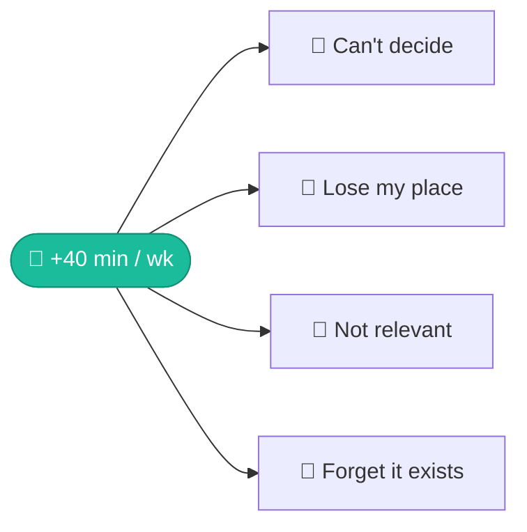

The one product outcome this quarter. Every opportunity and solution below is a bet on how to move it.

> [!abstract] Product outcome, not output
> We do not ship features to ship features. We ship to move minutes-per-subscriber. Four opportunities, surfaced in 18 customer interviews, are the most promising paths to it.

